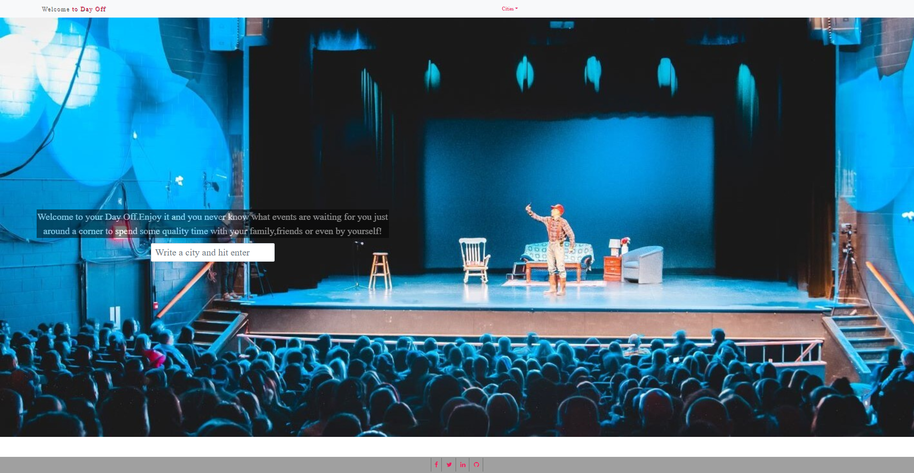
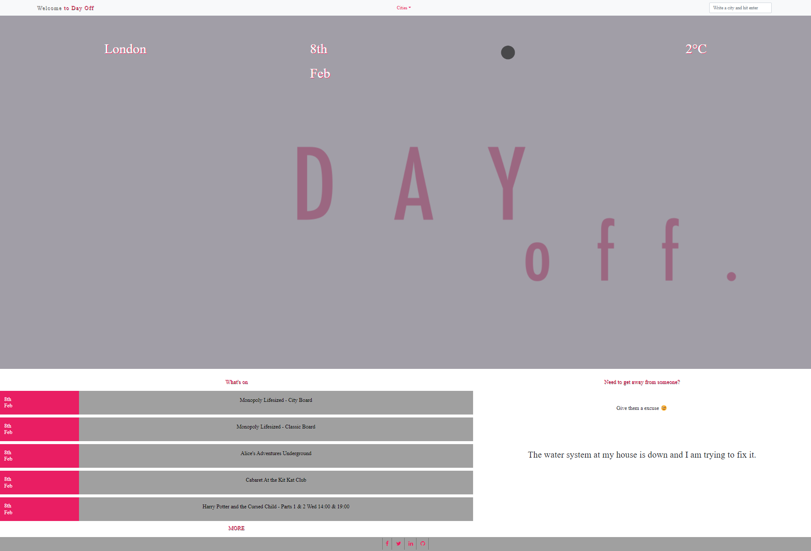
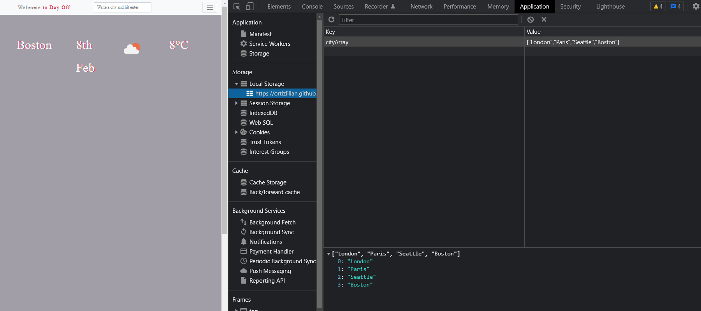

# Project `1`: DayOff

## Description

This app functions as personal dashboard, it gives weather and events information. The purpose of this website is to be the default website of the user's browser. So that, the user can get info about the weather and the events happening on the day he is accessing it.

## Deployment

The app was deployed using Github Pages and can be accessed [here](https://ortizlilian.github.io/project1-bootcamp/).

## Screenshots

This is the home page of the website:

This is what shows when the user search a city in the main input:

Here the data saved to local storage:

## Resources

The website uses 3 different server-side apis:
- The [OpenWeatherMap](https://openweathermap.org/api) api is used to get the current weather of the city searched.
- The [TicketMaster](https://developer.ticketmaster.com/) api is used to get the event info from TicketMaster database.
- Finally, we used the [ExcuserApi](https://excuser-three.vercel.app/) to display random excuses on the website, to amuse the user. 

## Tech-Stack

The website was developed using JavaScript as main programming language. jQuery was the main js library used for this project. Additionally, 3 server-side apis were deployed: Open Weather Map, Ticket Master api and Excuser api. Finally, Bootstrap was used mainly to position elements, and css was used to add the other styling. 

